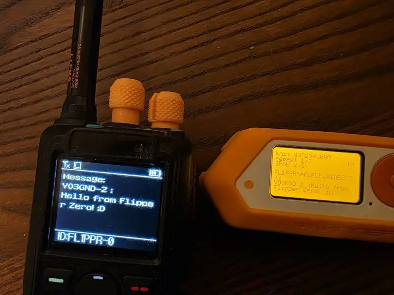
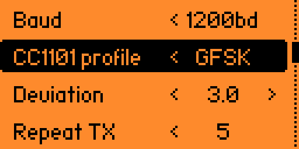
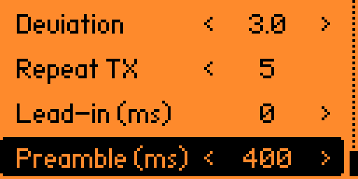

An experimental APRS / AX.25 transmitter for Flipper Zero.

Idea and prototype by [Richard YO3GND](https://www.qrz.com/db/YO3GND) - [Read tech post](https://yo3gnd.ro/blog/flipper-zero-aprs-tx)


There are plenty of audio APRS hacks that feed a handheld with audio from Flipper. This is not that. This is a SubGHZ hack that allows you to send something APRS-like using only the FZ. Decode success is still inconsistent; the signal is unconventional, imperfect, and heavily dependent on the receiver. Software seems to do fine with it (direwolf, qtmm). Some hardware decoders struggled. An UV878 works. It is malformed badly enough, losing phase information and bending the encoding to keep up with what the Flipper can do, that I am still surprised it works.

<p align="center">  </p>

This app can send:
- APRS messages
- status packets
- bulletins
- fixed position packets

It lets you manage each packet type, keep a small destination callbook, and tune a few radio-side parameters to improve decoding. However, at its core, this is a deliberately rough FSK hack pretending to be FM, and it relies heavily on the receiver's discriminator and filters.

 


 

## Usage

To use this, you will need to configure your handheld or a gateway, like direwolf, on an ISM frequency. If you intend to transmit on the actual APRS network, your country's licensing restrictions apply; 70cm APRS is outside ISM but still within Flipper's reach. By default, the address book contains two entries: `FL1PER-0` and one of my SSIDs, `YO3GND-12`. You can easily add more. With 100mW to work with, height matters; do not expect to hit your local gateway from indoors.

To reduce the chance of accidental traffic on the live APRS network, the default identity is the clearly artificial callsign `FL1PER-0`, which, luckily enough, sits in a rarely used `F` block. That makes experimental packets easier to recognize and filter.

- If it doesn't work for you: enable debug mode, then press up/down to change deviation or left to toggle 2FSK/GFSK. Find a setting that works. It might take a few tries and different orientations for the first message to decode

## Build

```sh
./fbt build APPSRC=flipperham
./fbt launch APPSRC=flipperham
```

- application.fam will import gitver.py to get the latest revision id from git plus some metadata. This metadata will be burnt into the elf

## Notes

- This is still experimental.
- Decode quality depends a lot on deviation, receiver, and timing.
- Only transmit where you are legally allowed to do so.

## Ham Usage
- Update `/ext/ham/my-callsigns.txt` on the SD card with one callsign per line. Each callsign may have an optional standard SSID; the SSID can be updated in the app. Each callsign must be followed by a comma and the IS passcode.
